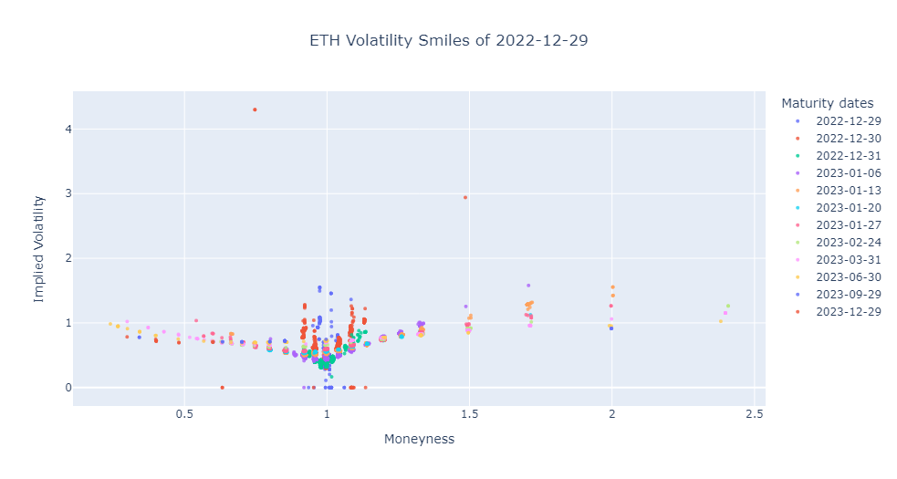
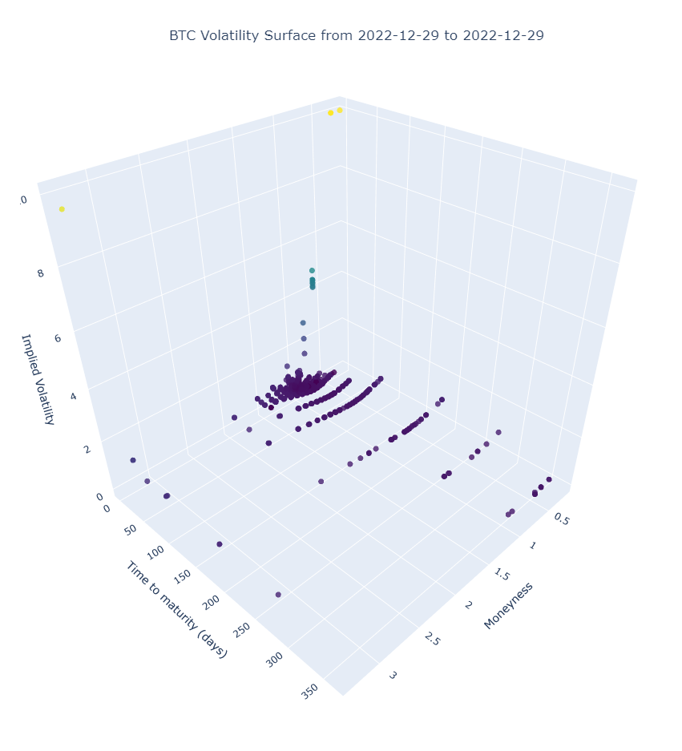

 

  

<h3 align="center">Visualize Crypto Option trades</h3>

  

    Visualize Cryptocurrency option trades using Deribit API v2
     
    <a href="https://github.com/BarendPotijk/visualize_crypto_options/"><strong>Explore the docs »</strong></a>
     
     
    <a href="https://github.com/BarendPotijk/visualize_crypto_options/tree/main/EXAMPLES">View examples </a>
  

## Project description
The visualize_crypto_options repository visualizes cryptocurrency (BTC, ETH, SOL, USDC) options traded on the cryptocurrency derivative platform Deribit (https://www.deribit.com). 
All crypto option trades of the last 5 days are publicly available in the Deribit API v2.1.1 under `/public/get_last_trades_by_currency_and_time`. 
For further information and the documentations see https://docs.deribit.com/#public-get_last_trades_by_currency_and_time. 

## Workings
The Deribit API gets called asynchronously to collect all options trades of a specified `currency` ranging from `start_date` to `end_date`. Each command returns a maximum of 1000 option trades JSON structured like this (real example):
 
 

 
 
These option trades are transformed in a workable pandas dataframe:

 
 
The dataframe is used to display implied volatility smiles:
 
 

 
 
And volatility surface:
 
 

  
 
