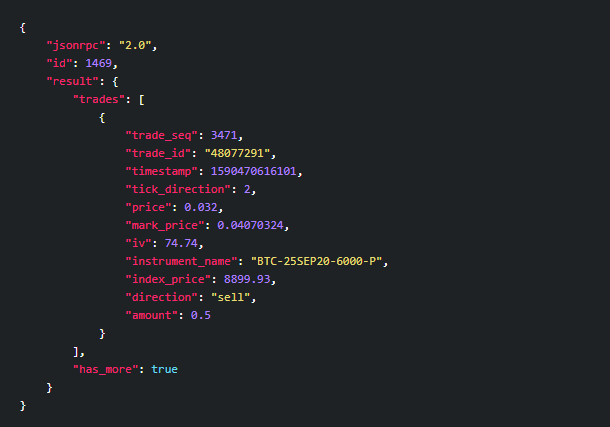
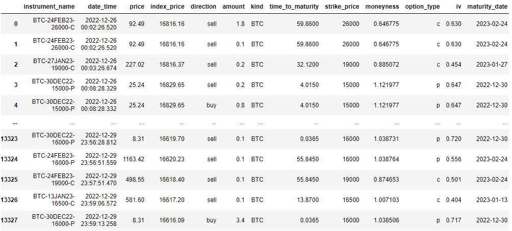

 

  

<h3 align="center">Visualize Crypto Option trades</h3>

  

    Visualize Cryptocurrency option trades using Deribit API v2
     
    <a href="https://github.com/BarendPotijk/visualize_crypto_options/"><strong>Explore the docs »</strong></a>
     
     
    <a href="https://github.com/BarendPotijk/visualize_crypto_options/tree/main/EXAMPLES">View examples </a>
  

## Project description
 

 

 
  
